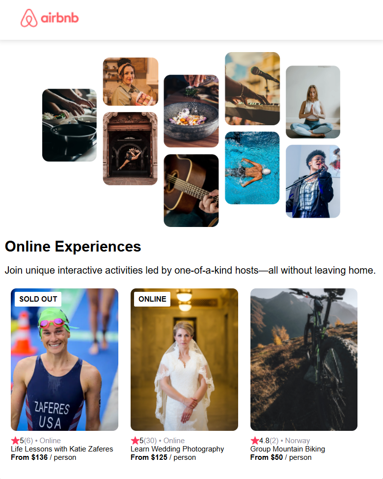

# Scrimba - Airbnb Clone solution
This is a solution to the Airbnb Clone project on [Scrimba](https://v2.scrimba.com/learn-react-c0e).

## Table of contents
- [Overview](#Overview)

## Overview

### Requirements
- Import data from a separate  file
  - Title, description, price, cover image, rating, review count, location, open spots
- Use .map() and props
- Style & polished
- Responsive

### Screenshot
This is a screenshot of how the project looks.


### Getting Started with Create React App
This project was bootstrapped with [Create React App](https://github.com/facebook/create-react-app).

## Available Scripts
If you want to see the complete project with the complete UX/UI experience, you can clone this repository.
Then in the project directory, you can run:

### `yarn start`
Runs the app in the development mode.\
Open [http://localhost:3000](http://localhost:3000) to view it in your browser.

## My process

### Technologies used

- HTML5
- CSS
- React.JS
- Grid

I used grid instead of only flexbox because it's easier for me to make the page responsive and organize components

### What I Learnt
```js
// Required to display local imgs in src folder
// I used it to avoid importing images all the time

```

```js
// Using JS into the components to asign a value to a variable for conditional rendering
let badgeText
if (props.openSpots === 0) {
    badgeText = "SOLD OUT"
} else if (props.location === "Online") {
    badgeText = "ONLINE"
}

// If the variable is different from 'None' card--badge div will display the corresponding badgeText
<div className="card">
  {badgeText && <div className='card--badge'>{badgeText}
</div>}
```

## Author
Jose Manuel Villa 
